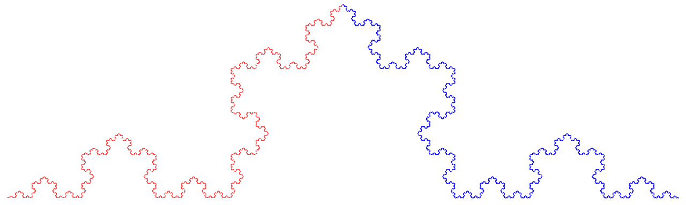
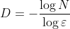
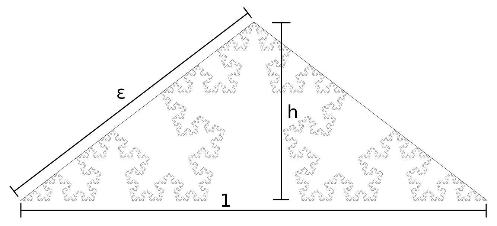
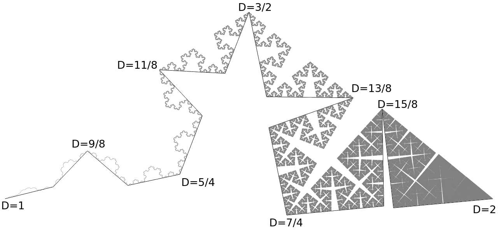

# Curve

A fractal curve with local fractal dimension changing continuously from 1 to 2.

## Koch-like curves

This curve is based on the [Koch curve](https://en.wikipedia.org/wiki/Koch_snowflake).

The standard Koch curve (⅓ of the snowflake) can be seen as composed of two upside-down copies of itself.

It turns out that by modifying the distance at which those two equal parts meet from the base line (the height) we can get a curve that has any fractal dimension from 1 to 2. With the zero height we get a straight line with dimension 1. With the height equal to half of the base length the lines start overlapping and they [fill](https://en.wikipedia.org/wiki/Space-filling_curve) an isosceles right triangle.

To find the fractal dimension for the given height we can use [the general formula](https://en.wikipedia.org/wiki/Fractal_dimension#Role_of_scaling) , where N is the number of self-similar parts and ε is the scaling factor. In this case N=2 and ε is the distance from one end of the base line to the point when the two parts meet if we set the base length to 1.

For actual computations it's easier to use the height instead of ε, it's easy to get one in relation of the other using the Pythagorean theorem: ε = sqrt(h²+¼), h = sqrt(ε²-¼). So we get D = -log 2/log (sqrt(h²+¼)) = -2log 2/log (h²+¼). We can verify that for h=0 we get -2log 2/log ¼ = 1 and for h=½ we get -2log 2/log ½ = 2.

The other way, it's easy to see that ε = 2^(-1/D), so we get h = sqrt(4^(-1/D) - ¼).

## Construction of this curve

Similar to Koch-like curves described above, this curve is constucted in iterations, each time replacing each line by two lines of equal length meeting at some distance (height) from the line being replaced. However in this case the height is not constant, it depends on D value at the meeting point of the two new lines, using the above formula h = sqrt(4^(-1/D) - ¼). D values at the ends of the whole curve are 1 and 2, and the D value of each new meeting point is the arithmetic mean of D values at both ends.

## Local fractal dimension

By local fractal dimension at a point of a set I understand a limit of fractal dimensions of neighborhoods of this point as the diameter of the neighborhood tends to zero.

I don't have a formal proof, but it's easy to see why the D value at a given point should be equal to the local fractal dimension at this point. D values are close at close points, so as we zoom into one point, the neighborhood is getting similar to a fragment of the Koch-like curve with fractal dimension D. For example the original Koch curve has fractal dimension log 4/log 3 ≈ 1.26186, which is close to 5/4. It's easy to see that the neighborhood of the point with D = 5/4 (see above) is very similar to the Koch curve.

## Author

Jan Szejko

## License

This project is licensed under the MIT License - see the LICENSE file for details.
